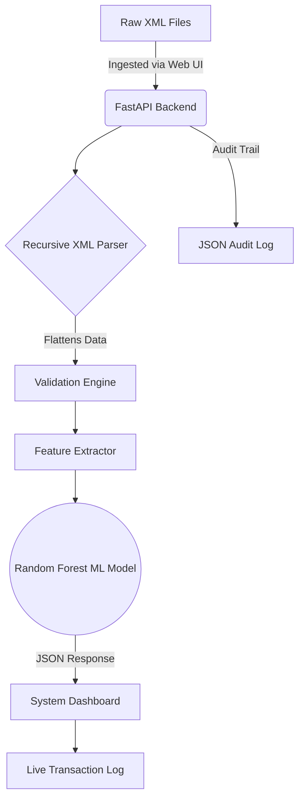

# SupplyTrace: Enterprise XML Validation & Risk Prediction

  

## Overview
Enterprise systems process millions of supplier transactions using XML documents that move across multiple processing stages before reaching the final business application. During this process, XML files may become invalid, incomplete, delayed, or fail to process correctly, resulting in silent downstream failures.

**SupplyTrace** is a lightweight, full-stack XML monitoring and validation system. It automatically ingests deeply nested enterprise XML files (e.g., UBL-style invoices), validates required fields, runs a Machine Learning model to predict processing risk, and presents failure insights through an interactive web dashboard.

This project reduces manual verification effort and drastically improves visibility into XML processing reliability.

## Architecture



## Key Features
1. **Deep Recursive XML Parsing**: Automatically traverses infinitely nested enterprise XML payloads using dot-notation flattening, and intelligently maps critical identifiers (like `ID` and `Amount`) without rigid schema definitions.
2. **Machine Learning Risk Prediction**: Uses a trained `scikit-learn` Random Forest Classifier (achieving **94% accuracy**) to assess hidden metadata (like latency, file size, and missing field ratios) to predict the likelihood of a transaction failing in the downstream application.
3. **Enterprise Dashboard**: A glassmorphic, responsive web interface that instantly visualizes historical failure rates, average risk scores, and total processed volume. Interactive hover tooltips explain each metric in detail.
4. **Live Transaction Inspector**: A drag-and-drop tool within the dashboard that allows analysts to simulate a payload in real-time to see exactly how the ML model interprets the data.
5. **Transaction History Feed**: A scrollable log of the most recent XML transactions, displaying file names, validation statuses, risk scores, and error summaries. Updates in real-time as new files are analyzed.
6. **Compliance Audit Logging**: Every transaction processed (both via the batch pipeline and the web UI) is recorded as a structured JSON Lines (`.jsonl`) audit trail for enterprise compliance and traceability.

## Directory Structure

```text
SupplyTrace/
├── frontend/             # Vanilla JS/HTML/CSS Web Application
│   ├── index.html        # Dashboard, Inspector, & Transaction Log UI
│   ├── styles.css        # Glassmorphism styling, tooltips, & animations
│   └── app.js            # Fetch API integration & dynamic table rendering
├── src/                  # Core Python Pipeline
│   ├── api/              # FastAPI server (server.py)
│   ├── ingestion/        # Recursive XML loader & intelligent parser
│   ├── validation/       # Deterministic rules engine
│   ├── features/         # Feature engineering (metadata extraction)
│   ├── prediction/       # ML inference wrapper
│   ├── pipeline/         # Orchestrator with audit logging
│   └── dashboard/        # BI Dashboard CSV Exporter
├── models/               # Serialized ML model weights (Random Forest)
├── results/              # Output CSVs, audit logs, & historical tracking
├── scripts/              # Helper utilities (generate_data.py, run_pipeline.py)
└── tests/                # Full pytest suite validating pipeline integrity
```

## REST API Endpoints

| Method | Endpoint | Description |
|:---|:---|:---|
| `POST` | `/api/analyze` | Upload an XML file for validation and ML risk prediction |
| `GET` | `/api/stats` | Retrieve aggregated dashboard metrics (failure rate, avg risk, etc.) |
| `GET` | `/api/history` | Fetch the 15 most recent processed transactions for the log feed |

## Getting Started

### Prerequisites
- Python 3.10+
- A modern web browser

### Installation
1. Clone the repository:
   ```bash
   git clone https://github.com/vishnuatgit/SupplyTrace.git
   cd SupplyTrace
   ```
2. Create and activate a virtual environment:
   ```bash
   # Windows
   python -m venv venv
   .\venv\Scripts\Activate.ps1
   
   # Linux/Mac
   python3 -m venv venv
   source venv/bin/activate
   ```
3. Install dependencies:
   ```bash
   pip install -r requirements.txt
   ```

### Running the System

1. **Generate Enterprise Test Data**  
   Run the data generator to create highly nested UBL-style XML test files inside `data/raw_xml/`.
   ```bash
   python scripts/generate_data.py
   ```

2. **Train the ML Model & Process Batch Data**  
   Run the pipeline to process the generated data, extract features, and train the Random Forest model.
   ```bash
   python -m scripts.run_pipeline
   ```

3. **Start the Web Dashboard**  
   Boot up the FastAPI server, which hosts both the REST endpoints and the static frontend.
   ```bash
   python -m src.api.server
   ```

4. **Access the Application**  
   Open your browser and navigate to:  
   **[http://127.0.0.1:8000](http://127.0.0.1:8000)**  
   *You can drag and drop the generated files from `data/raw_xml/` directly into the UI to test the live inspector.*

## Testing
SupplyTrace is fully tested using `pytest`. The test suite covers ingestion, validation, feature extraction, and prediction to ensure robust CI/CD integration.
```bash
python -m pytest tests/
```

## License
Developed as an enterprise architecture solution and portfolio demonstration. All rights reserved.
