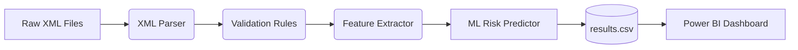

# SupplyTrace

Ever dealt with thousands of messy, nested XML files crashing a downstream business application? **SupplyTrace** is my solution to exactly that.

At its core, SupplyTrace is a Python-based data pipeline that acts as a safety net. It intercepts raw supplier XML transactions, cleans them up, flags the broken ones (like missing IDs or blank amounts), and runs them through a machine learning model to predict if they're going to fail before they ever reach the main system.

It's built to be robust but straightforward, taking the headache out of unstructured, unreliable supplier data.

## What It Does
- **Ingestion & Parsing**: Safely reads messy XML files and flattens them into something actually usable.
- **Rules Engine**: Automatically flags transactions as `VALID`, `INVALID`, or `REQUIRES_REVIEW` so bad data doesn't slip through.
- **Feature Extraction**: Pulls out hidden metrics (like processing latency, missing fields, and file size) that hint at underlying data quality issues.
- **Machine Learning**: Uses a SciKit-Learn Random Forest model to look at historical patterns and predict a *Risk Percentage* for each file.
- **Data Export**: Generates clean, structured CSV datasets ready to be dropped straight into Power BI for visualizations.

## How It Works



## Project Structure

```
SupplyTrace/
├── src/
│   ├── ingestion/        # XML loading and parsing
│   │   ├── xml_loader.py # Reads raw XML files safely
│   │   └── parser.py     # Standardizes parsed data (keys → uppercase)
│   ├── validation/       # Deterministic rules engine
│   │   └── rules.py      # VALID / INVALID / REQUIRES_REVIEW classification
│   ├── features/         # Feature engineering for ML
│   │   └── extractor.py  # Extracts missing_fields, xml_size, processing_time
│   ├── prediction/       # Machine learning layer
│   │   └── model.py      # RandomForestClassifier with fit() and predict_risk()
│   ├── dashboard/        # Dashboard data export (upcoming)
│   └── utils/            # Shared utilities
├── scripts/
│   ├── generate_data.py  # Generates synthetic XML test data
│   └── run_pipeline.py   # End-to-end pipeline orchestrator
├── tests/                # Full pytest test suite
├── data/raw_xml/         # Input XML files
├── results/              # Pipeline output (results.csv)
├── docs/                 # Architecture documentation
└── requirements.txt
```

## How to Run It Locally

If you want to spin this up on your own machine, here's how:

### Prerequisites
Make sure you have Python 3.10+ and Git installed.

### 1. Clone the repo
```bash
git clone https://github.com/vishnuatgit/SupplyTrace.git
cd SupplyTrace
```

### 2. Set up your virtual environment
**If you're on Windows:**
```powershell
python -m venv venv
.\venv\Scripts\Activate.ps1
```
**If you're on Mac/Linux:**
```bash
python3 -m venv venv
source venv/bin/activate
```

### 3. Install the required packages
```bash
pip install -r requirements.txt
```
*(We're mainly using `pandas` for data wrangling, `scikit-learn` for the ML, and `pytest` for testing.)*

### 4. Give it a spin
I've included a script that generates a bunch of dummy XML data (some good, some deliberately broken) so you can see the pipeline in action.
```bash
# Generate the synthetic XML files
python scripts/generate_data.py

# Run the files through the entire pipeline
python scripts/run_pipeline.py
```
Check the `results/results.csv` file—you'll see exactly how the pipeline classified each file, the extracted features, and the ML-predicted risk scores.

### 5. Run the tests
There's a full test suite covering ingestion, validation, feature extraction, and ML prediction.
```bash
python -m pytest tests/
```

## License
Built for educational and portfolio purposes. Feel free to explore the code!
